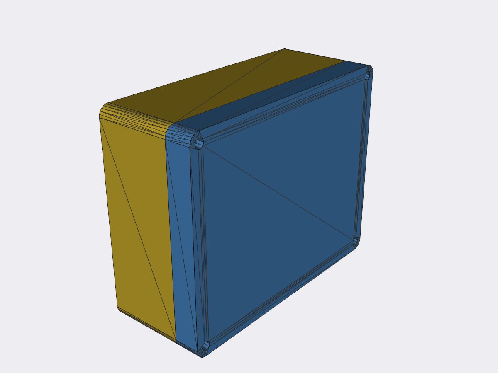
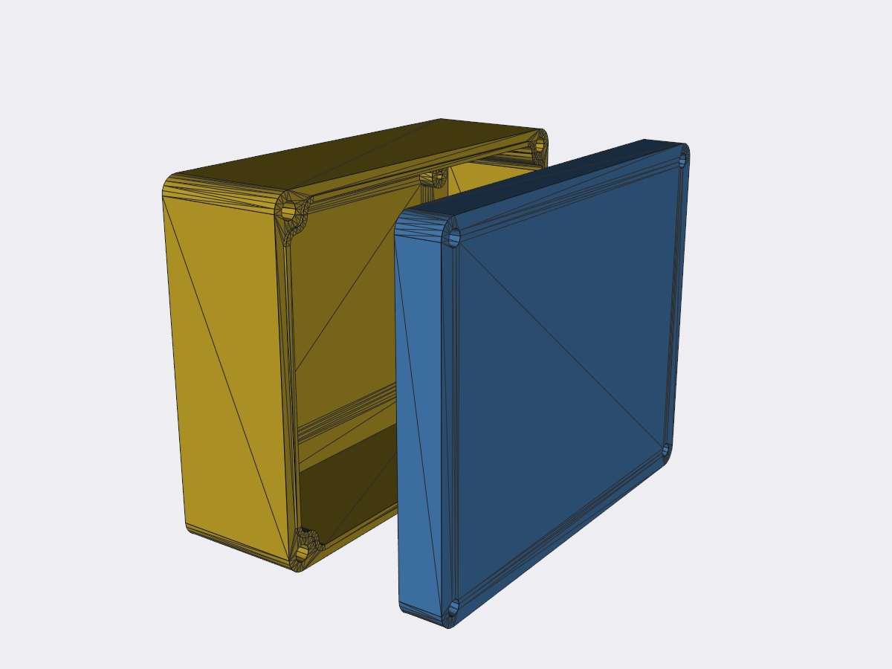
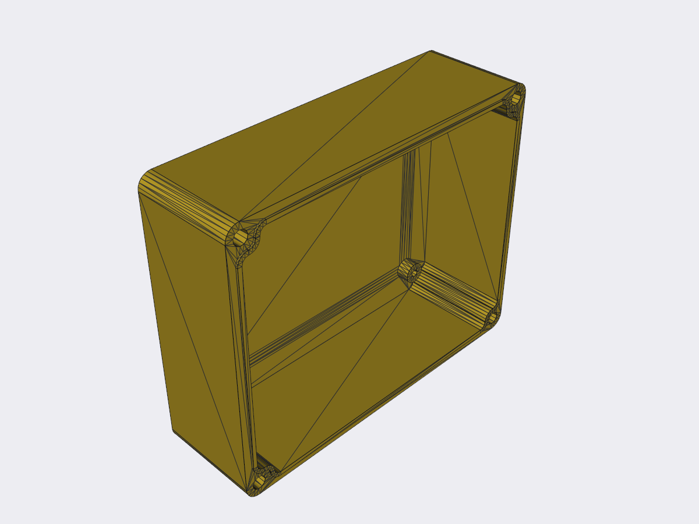
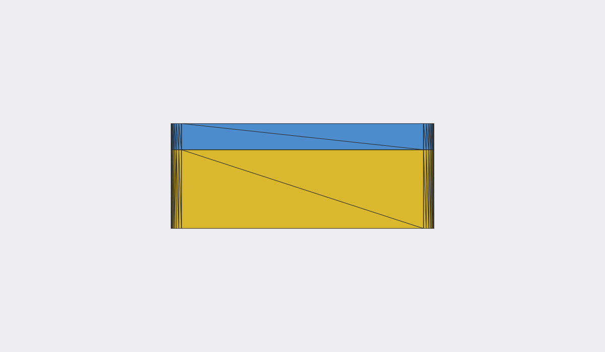
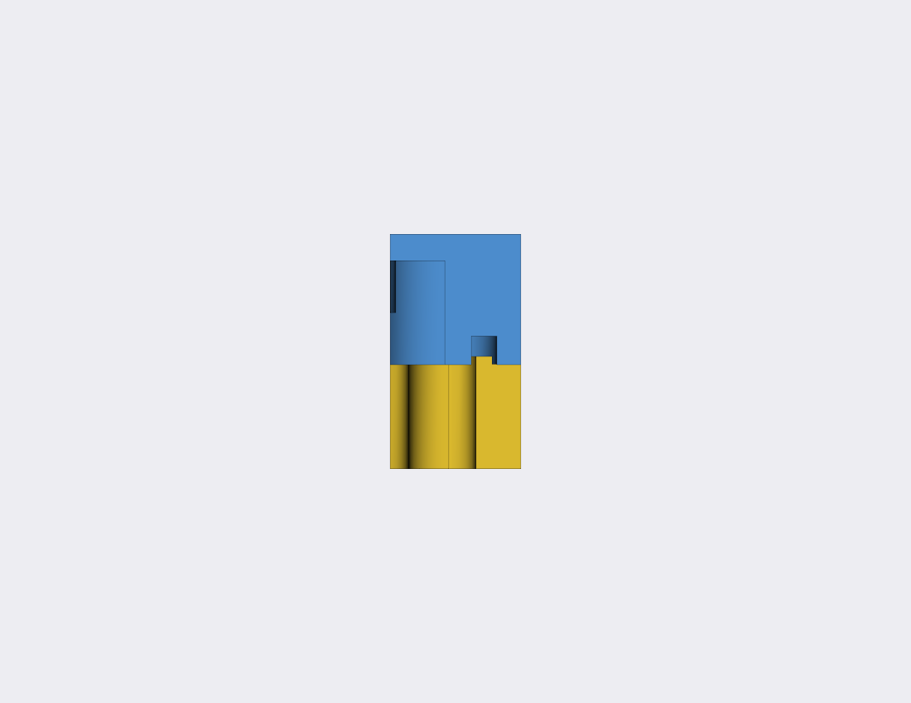
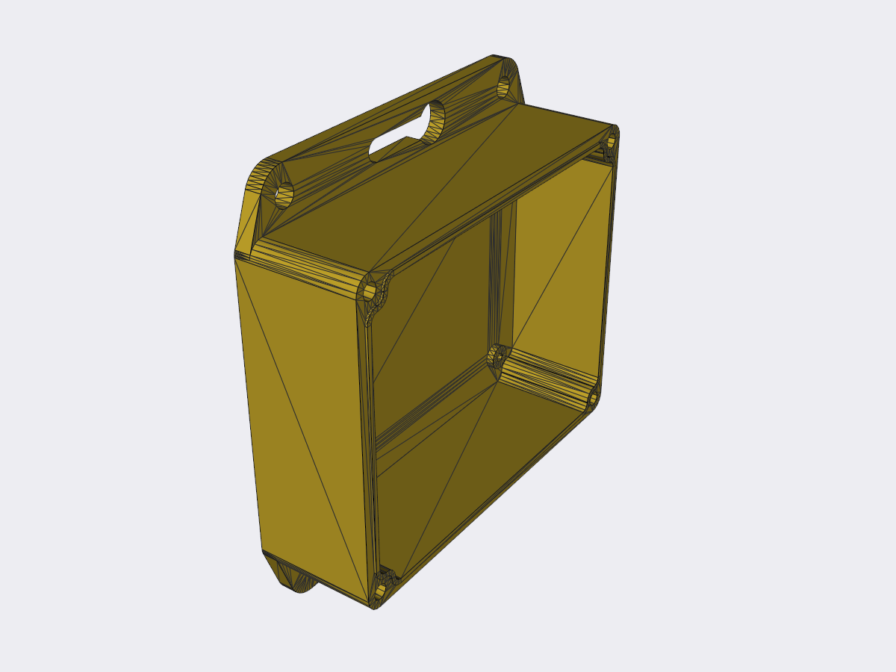

# enclosure

Parametric sealed enclosure generator (CadQuery). A two-part box (base + lid)
with an o-ring tongue-and-groove seal, corner screw posts for threaded inserts,
and an M5 wall-mount flange.

📦 **A selection of pre-built boxes is ready to download in the
[Releases](https://github.com/morganelectronics/enclozure/releases).**



| Exploded (with gap) | Base, no lid |
|---|---|
|  |  |
| **Side view** | **Section through the seal** |
|  |  |

With the flange and PCB standoffs enabled (`--flange --pcb-mounts`):



## Generate the archive

Exports `base` and `lid` (STEP + STL), a `pcb` outline (DXF) and a
`parameters` text file, bundled into a single `.zip` in the current directory:

```sh
uv run enclosure.py --width 100 --breadth 80 --lid-height 10 --base-height 30
```

Options:

| flag             | default | meaning                       |
|------------------|---------|-------------------------------|
| `--width`        | 100     | overall X (mm)                |
| `--breadth`      | 80      | overall Y (mm)                |
| `--lid-height`   | 10      | lid Z (mm)                    |
| `--base-height`  | 30      | base Z (mm)                   |
| `--flange`       | off     | add the M5 mount flange       |
| `--no-pcb-mounts`| off     | omit PCB standoffs (on by default) |
| `-o/--outdir`    | `.`     | output directory              |

Running with no arguments produces the default box (PCB standoffs on, no flange).

The zip always contains: `*_base.step/.stl`, `*_lid.step/.stl`, a `*_pcb.dxf`
(PCB outline inset `pcb_edge_clearance` from the inner wall, with M3 clearance
holes at the standoff positions) and `*_parameters.txt` (inputs + generated
values such as PCB hole spacing and flange hole sizes).

## Flange (opt-in, `--flange`)

A flat M5 mounting base. It is the **convex hull of one disc per centre**: the
corner pillars (at the pillar radius, so the hull reproduces the case outline)
plus a disc of radius `head_r + outer_wall` at every mounting hole and slot end
(so one wall thickness of plate is left around the big head hole). Being a hull
it is entirely convex — no
concave notches or thin "weak bits". Each long side carries a central keyhole
slot (eye + slot, parallel to the wall, ~2 head-widths long so the head drops
through the eye and slides fully over the plate) plus an end round hole either
side. As the box shrinks the round holes are dropped and only the keyhole slot
remains.

## PCB standoffs (on by default, `--no-pcb-mounts` to omit)

Fixed-height (`pcb_pillar_height`, 4 mm) self-tapper pillars (M3 pilot) are added
to **both** the base and lid inner surfaces, sitting on the diagonals
`pcb_wall_clearance` (4 mm) clear of the inner wall. The count adapts to size:
**4** on big boxes, dropping to a **diagonal pair**, then a **single central**
post on the smallest boxes.

## Box sizes

`box_sizes.py` lists nominal outer sizes (length, width, height) — feed them
into the generator (see `build_all.py`):

```sh
uv run box_sizes.py
```

## Sealing

The seal needs a length of **2 mm cross-section o-ring cord** (the `oring_notional`
value), seated in the lid groove. The groove depth is derived so the closed box
squashes the cord by `oring_compression` (**20%** by default) once the base ridge
is seated — change either parameter and the groove tracks it.

## 3D printing & materials

This design is intended to be **3D printed**.

- **PETG** is recommended for a waterproof box — it bonds between layers far better
  than PLA, so the walls and seal land actually hold water out.
- Harder, more brittle filaments (e.g. **PLA**) will print but the **screw threads
  are delicate** — especially the self-tapping-screw pillar variant, where the
  thread is formed directly in the plastic. Prefer the heat-set-insert variant (or
  PETG) if the lid will be opened repeatedly.

Pre-built boxes come in four variants — plain / flanged × heat-set-insert /
self-tapping-screw corner pillars — see the [Releases](https://github.com/morganelectronics/enclozure/releases).

## Inspect interactively

Open `enclosure.py` in CQ-editor (it injects `show_object`); toggle the
`show_object(...)` calls at the bottom to view the base, lid, or assembly.
`render_check.py` renders PNGs head-less via VTK.
