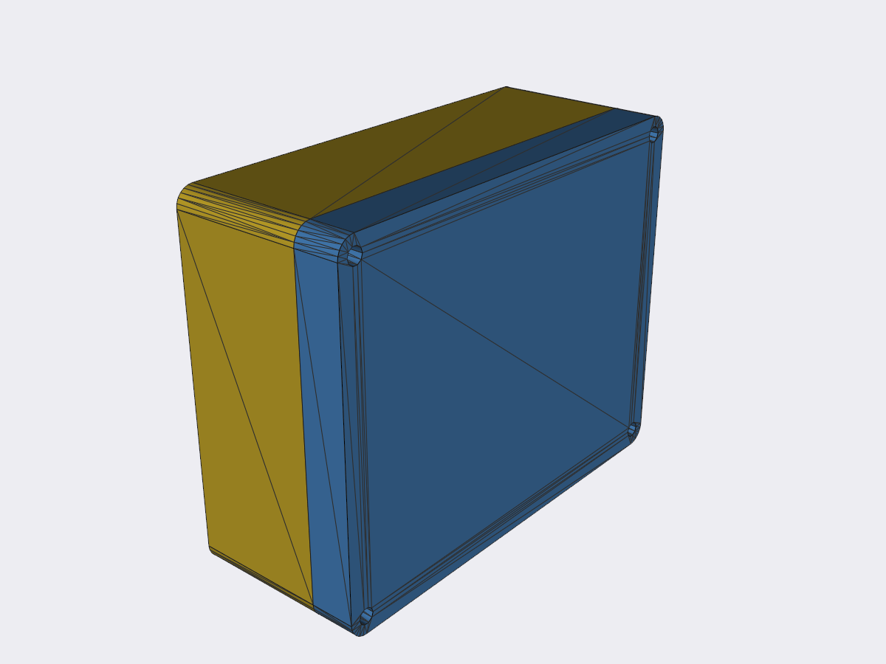
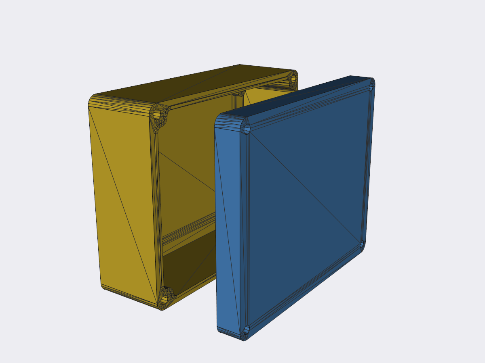
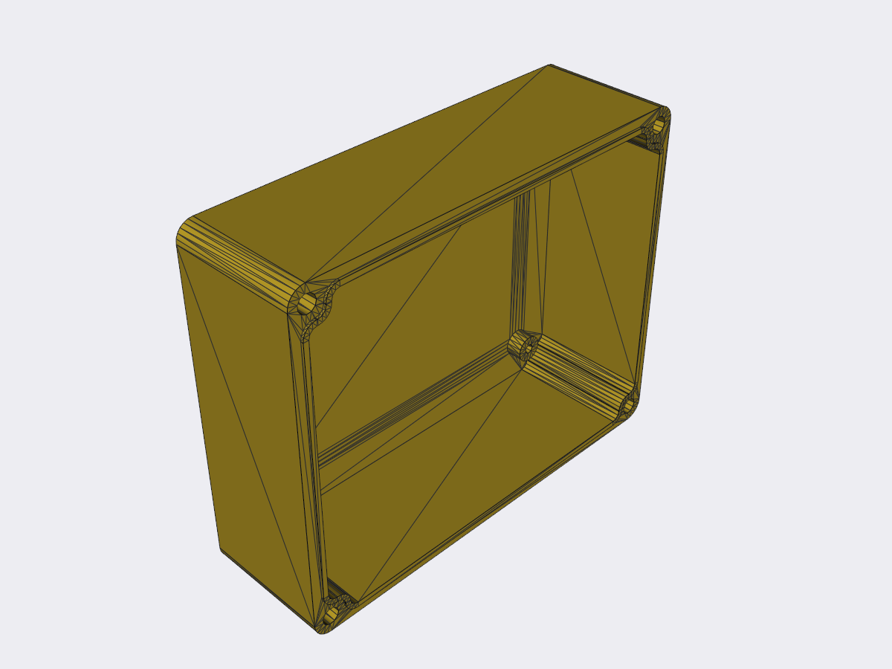
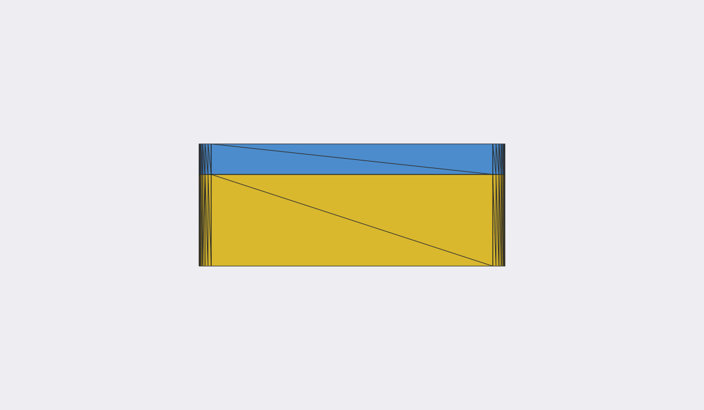
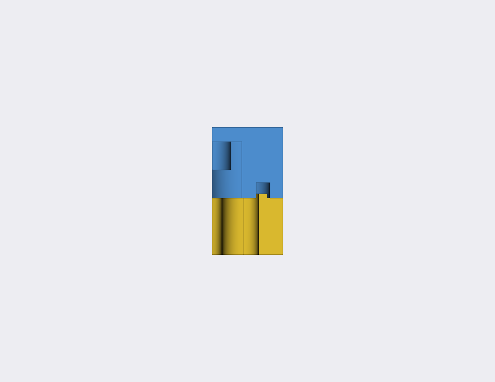
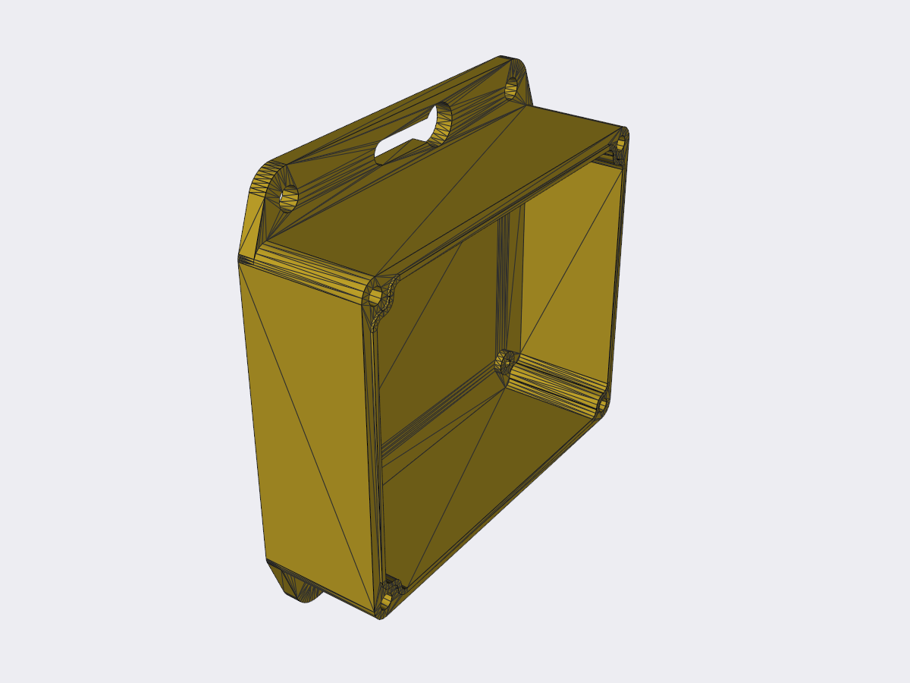
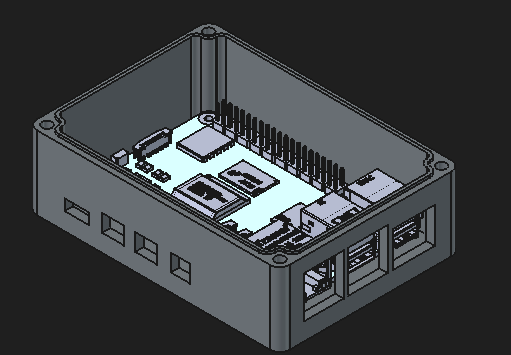

# enclosure

Parametric sealed enclosure generator (CadQuery). A two-part box (base + lid)
with an o-ring tongue-and-groove seal, corner screw posts for threaded inserts,
an M5 wall-mount flange, and PCB standoffs with a matching PCB outline (DXF)
for the top and bottom. Board presets (Arduino / Raspberry Pi) place the
standoffs on the real mounting holes and cut connector openings in the walls.

📦 **A selection of pre-built boxes is ready to download in the
[Releases](https://github.com/morganelectronics/enclozure/releases).**



| Exploded (with gap) | Base, no lid |
|---|---|
|  |  |
| **Side view** | **Section through the seal** |
|  |  |

With the flange and PCB standoffs enabled (`--flange --pcb-mounts`):



With the connector holes and standoffs in correct position for raspberry pi-b



## Generate the archive

Exports `base` and `lid` (STEP + STL), a `pcb` outline (DXF) and a
`parameters` text file, bundled into a single `.zip` in the current directory:

```sh
uv run enclosure.py --width 100 --breadth 80 --lid-height 10 --base-height 30
```

Options:

| flag             | default | meaning                       |
|------------------|---------|-------------------------------|
| `--width`        | 100     | overall X (mm)                |
| `--breadth`      | 80      | overall Y (mm)                |
| `--lid-height`   | 10      | lid Z (mm)                    |
| `--base-height`  | 30      | base Z (mm)                   |
| `--flange`       | off     | add the M5 mount flange       |
| `--no-pcb-mounts`| off     | omit PCB standoffs (on by default) |
| `--board`        | —       | standoffs for a known board (Arduino / Raspberry Pi) |
| `--pcb-offset`   | `0 0`   | shift the `--board` pattern from centre (X Y mm) |
| `--pcb-pos`      | —       | one standoff distance from centre, mirrored to 4 corners |
| `--no-connectors`| off     | omit the board's connector openings in the base walls |
| `--cutout`       | —       | add a custom opening: `SIDE POS WIDTH HEIGHT` (repeatable) |
| `--list-boards`  | —       | list the supported board presets and exit |
| `-o/--outdir`    | `.`     | output directory              |
| `--pcb-hole`     | 2.5 (or boards preset value) | will change the diameter of the hole for the pcb mounting stand offs in the enclosure |
| `--oring-compression` | 0.20 | this changes how much the oring in the seal will be compressed by from a minimum of 0.0 to a maximum of 1.0 | 
| `--seal-style` | cross | by changing this to either cross or round then the corners of the sealing |
| `--seal-corner-radius` | auto per style, clamped | changes the radius of the corner for the seal |
| `--corner-radius` | auto (10% of the short side) | outside corner radius |

Running with no arguments produces the default box (PCB standoffs on, no flange).

The zip always contains: `*_base.step/.stl`, `*_lid.step/.stl`, a PCB outline
for each part (`*_pcb_base.dxf` and `*_pcb_lid.dxf` — the base and lid cavities
differ, so the boards do too; each is inset `pcb_edge_clearance` from that
part's inner wall, with M3 clearance holes at the standoff positions) and
`*_parameters.txt` (inputs + generated values such as PCB hole spacing and
flange hole sizes).

## Flange (opt-in, `--flange`)

A flat M5 mounting base. It is the **convex hull of one disc per centre**: the
corner pillars (at the pillar radius, so the hull reproduces the case outline)
plus a disc of radius `head_r + outer_wall` at every mounting hole and slot end
(so one wall thickness of plate is left around the big head hole). Each long
side carries a central keyhole slot (eye + slot, parallel to the wall, ~2
head-widths long so the head drops through the eye and slides fully over the
plate) plus an end round hole either side. As the box shrinks the round holes
are dropped and only the keyhole slot remains.

## PCB standoffs (on by default, `--no-pcb-mounts` to omit)

Fixed-height (`pcb_pillar_height`, 4 mm) self-tapper pillars (M3 pilot) are added
to **both** the base and lid inner surfaces, sitting on the diagonals
`pcb_wall_clearance` (4 mm) clear of the inner wall. The count adapts to size:
**4** on big boxes, dropping to a **diagonal pair**, then a **single central**
post on the smallest boxes.

### Positioning standoffs for a specific board (`--board`)

To mount an actual Arduino or Raspberry Pi, pass `--board NAME` instead of the
auto layout. The standoffs are placed at that board's real mounting-hole
coordinates (the board sits centred in the box) and the pilot / PCB-clearance
holes are sized for that board's screw (Arduino → M3, Raspberry Pi → M2.5, Pico
→ M2). List the presets with `--list-boards`:

| name           | board                                   | screw |
|----------------|-----------------------------------------|-------|
| `arduino-uno`  | Arduino Uno R3 / Leonardo (68.6×53.3)   | M3    |
| `arduino-mega` | Arduino Mega 2560 / Due (101.6×53.3)    | M3    |
| `rpi-b`        | Raspberry Pi B+/2/3/4/5 (85×56)         | M2.5  |
| `rpi-a`        | Raspberry Pi 3 A+ (65×56)               | M2.5  |
| `rpi-zero`     | Raspberry Pi Zero / W / 2 W (65×30)     | M2.5  |
| `rpi-pico`     | Raspberry Pi Pico / Pico W (51×21)      | M2    |

```sh
# Raspberry Pi 4 in a 100×80 box
uv run enclosure.py --board rpi-b

# Arduino Uno, nudged 5 mm in +Y to clear a wall feature
uv run enclosure.py --board arduino-uno --pcb-offset 0 5
```

If a hole falls outside (or too close to) the cavity wall the generator prints a
**WARNING** naming the offending standoffs — enlarge the box (`--width` /
`--breadth`) or shift the pattern with `--pcb-offset`. Custom one-off layouts are
still available via `--pcb-pos X Y` (one distance mirrored to all four corners).

Add a new board by extending the `BOARDS` table near the top of `enclosure.py`:
give its outline `size`, the mounting-hole `holes` (measured from the board's
bottom-left corner), and the `screw` pilot and PCB `clearance` diameters.

### Connector openings

When you pick a `--board`, matching **connector openings are cut into the base
walls** (USB, HDMI, Ethernet, power, …) so the ports are reachable with the lid
on. Each opening is a window positioned at the connector's real location, sized
with a little clearance, sitting above the board's top surface at

```
PCB top = outer_wall + pcb_pillar_height + pcb_board_thickness   (= 2 + 4 + 1.6 = 7.6 mm)
```

and rising by the connector's height. Openings are **clamped below the seal rim**
so they never breach the o-ring groove; if a tall connector (e.g. the Pi's
stacked USB) won't fit the base height, its window is clipped and a **WARNING**
is printed — raise `--base-height` for the full opening. Cutouts are in the
**base only** (that's where the board is mounted), so the board is dropped/tilted
in with the lid off.

- **`rpi-b`** ships the full **Pi 4 / Pi 5** port layout (USB‑C, 2× micro‑HDMI,
  A/V jack, Ethernet, 2× USB) taken from the official Pi 4B datasheet. The
  mounting holes are shared with the B+/2/3, but those older boards have a
  different port layout — use `--no-connectors` (or `--cutout`) for them.
- **`arduino-uno` / `arduino-mega`** cut the USB‑B and barrel‑jack openings.
  These positions are **approximate** — check them against your board and tune
  in the `BOARDS` table or with `--cutout` if needed.

```sh
uv run enclosure.py --board rpi-b                    # Pi 4 with all port cutouts
uv run enclosure.py --board rpi-b --no-connectors    # standoffs only, solid walls
```

For a board without a preset (or an extra hole — antenna, switch, cable gland),
add openings directly with `--cutout SIDE POS WIDTH HEIGHT` (repeatable), where
`SIDE` is `+x`/`-x`/`+y`/`-y`, `POS` is the opening centre along that wall
measured from the box centre, `WIDTH` is its size along the wall, and `HEIGHT`
is its rise above the PCB top surface (all mm):

```sh
# a 20×10 mm opening centred on the +Y wall
uv run enclosure.py --cutout +y 0 20 10
```

To give a preset board its own connectors, add a `connectors` list to its
`BOARDS` entry — each item is `{"side", "pos", "w", "h", "desc"}` with `pos` in
board coordinates (along that edge) and `h` the height above the PCB.

## Box sizes

`box_sizes.py` lists nominal outer sizes (length, width, height) — feed them
into the generator (see `build_all.py`):

```sh
uv run box_sizes.py
```

## Sealing

The seal needs a length of **2 mm cross-section o-ring cord** (the `oring_notional`
value), seated in the lid groove. The groove depth is derived so the closed box
squashes the cord by `oring_compression` (**20%** by default) once the base ridge
is seated — change either parameter and the groove tracks it.

## 3D printing & materials

This design is intended to be **3D printed**. On an **FDM (filament) printer** it
is sized for a **0.4 mm nozzle** — wall thicknesses are multiples of 0.4 mm, so
the walls come out as a whole number of perimeters with no thin slivers. (Nozzle
width only affects wall thickness; vertical sizes are set by layer height and
X/Y clearances are just gaps.)

- **PETG** is recommended for a waterproof box — it bonds between layers far better
  than PLA, so the walls and seal land actually hold water out.
- Harder, more brittle filaments (e.g. **PLA**) will print but the **screw threads
  are delicate** — especially the self-tapping-screw pillar variant, where the
  thread is formed directly in the plastic. Prefer the heat-set-insert variant (or
  PETG) if the lid will be opened repeatedly.

Pre-built boxes come in four variants — plain / flanged × heat-set-insert /
self-tapping-screw corner pillars — see the [Releases](https://github.com/morganelectronics/enclozure/releases).

## Inspect interactively

Open `enclosure.py` in CQ-editor (it injects `show_object`); toggle the
`show_object(...)` calls at the bottom to view the base, lid, or assembly.
`render_check.py` renders PNGs head-less via VTK.
